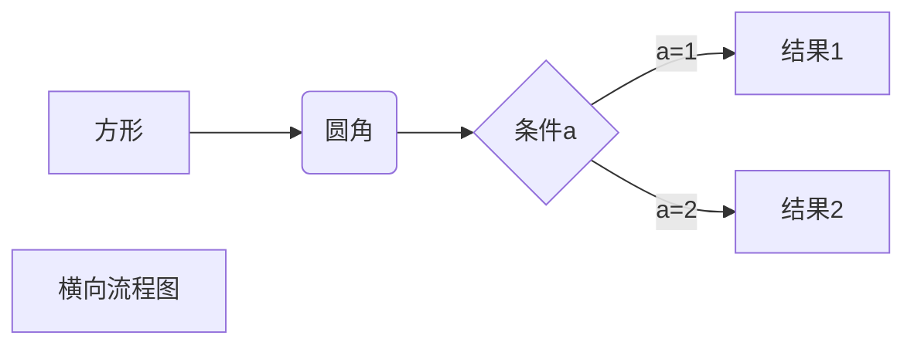
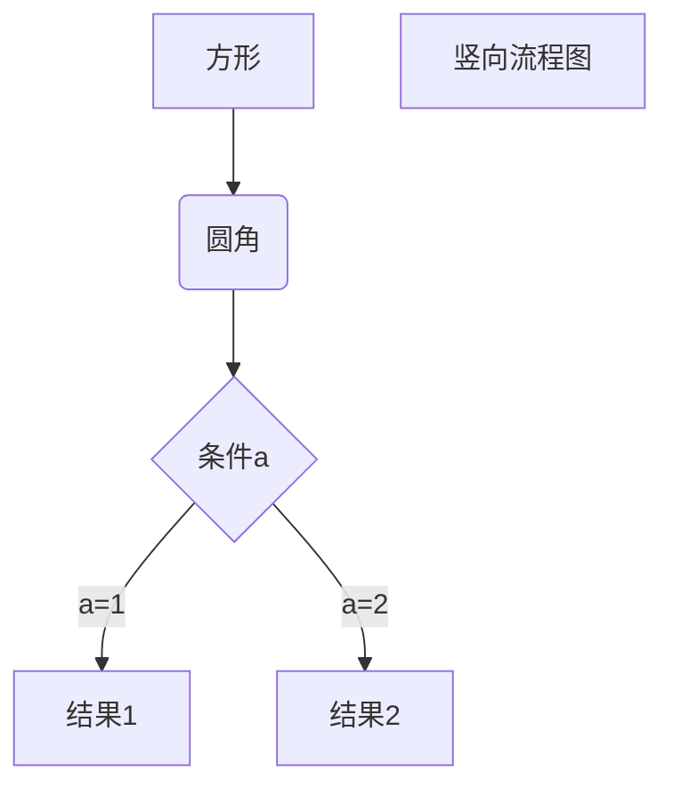
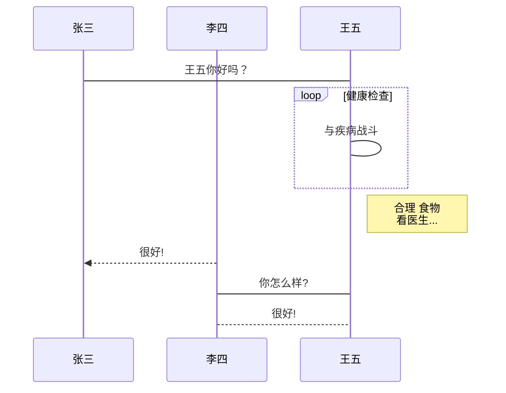
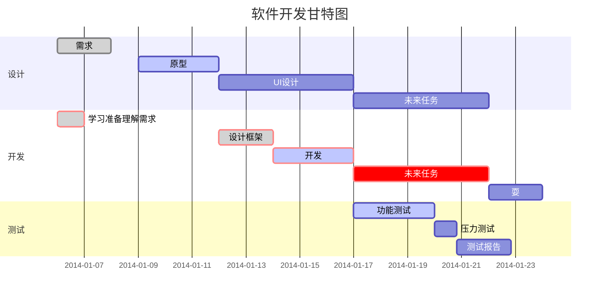

# Markdown 高级技巧
## 支持的 HTML 元素
不在 Markdown 涵盖范围之内的标签，都可以直接在文档里面用 HTML 撰写。

目前支持的 HTML 元素有：`<kbd>` ` <b> ` `<i>` ` <em> ` `<sup>` ` <sub> ` `<br>`等 ，如：
```

	使用 <kbd>Ctrl</kbd>+<kbd>Alt</kbd>+<kbd>Del</kbd> 重启电脑
	
```
输出结果为：

使用 <kbd>Ctrl</kbd>+<kbd>Alt</kbd>+<kbd>Del</kbd> 重启电脑

## 公式
Markdown Preview Enhanced 使用 KaTeX 或者 MathJax 来渲染数学表达式。

KaTeX 拥有比 MathJax 更快的性能，但是它却少了很多 MathJax 拥有的特性。你可以查看 KaTeX supported functions/symbols 来了解 KaTeX 支持那些符号和函数。

默认下的分隔符：

* `$...$` 或者` \(...\) `中的数学表达式将会在行内显示。
* `$$...$$` 或者` \[...\] `或者 `` ```math ``中的数学表达式将会在块内显示。
```

$f(x)=sin(x)+12$

$$\sum_ {n=1}^{100} n$$
	
```
输出结果为：
	$f(x) = sin(x) + 12$

$$\sum_ {n=1}^{100} n$$

	
### 公式画图
以下代码：
```

$$
\begin{Bmatrix}
   a & b \\
   c & d
\end{Bmatrix}
$$

$$
\begin{CD}
   A @>a>> B \\
@VbVV @AAcA \\
   C @= D
\end{CD}
$$
	
```
输出结果为：


$$
\begin{Bmatrix}
   a & b \\
   c & d
\end{Bmatrix}
$$

$$
\begin{CD}
   A @>a>> B \\
@VbVV @AAcA \\
   C @= D
\end{CD}
$$

### 公式画横向流程图

横向流程图源码格式：
~~~




~~~
效果图如下：


### 公式画竖向流程图
竖向流程图源码格式：
~~~



~~~
效果图如下：

### 公式画标准流程图
标准流程图源码格式：
~~~

```flow
st=>start: 开始框
op=>operation: 处理框
cond=>condition: 判断框(是或否?)
sub1=>subroutine: 子流程
io=>inputoutput: 输入输出框
e=>end: 结束框
st->op->cond
cond(yes)->io->e
cond(no)->sub1(right)->op
```
~~~
效果图如下：
```flow
st=>start: 开始框
op=>operation: 处理框
cond=>condition: 判断框(是或否?)
sub1=>subroutine: 子流程
io=>inputoutput: 输入输出框
e=>end: 结束框
st->op->cond
cond(yes)->io->e
cond(no)->sub1(right)->op
```
### 公式画标准流程图（横向）
标准流程图（横向）源码格式：
~~~

```flow
st=>start: 开始框
op=>operation: 处理框
cond=>condition: 判断框(是或否?)
sub1=>subroutine: 子流程
io=>inputoutput: 输入输出框
e=>end: 结束框
st(right)->op(right)->cond
cond(yes)->io(bottom)->e
cond(no)->sub1(right)->op
```

~~~
效果图如下：
```flow
st=>start: 开始框
op=>operation: 处理框
cond=>condition: 判断框(是或否?)
sub1=>subroutine: 子流程
io=>inputoutput: 输入输出框
e=>end: 结束框
st(right)->op(right)->cond
cond(yes)->io(bottom)->e
cond(no)->sub1(right)->op
```
### 公式画UML时序图
UML时序图源码格式：
~~~

```sequence
对象A->对象B: 对象B你好吗?（请求）
Note right of 对象B: 对象B的描述
Note left of 对象A: 对象A的描述(提示)
对象B-->对象A: 我很好(响应)
对象A->对象B: 你真的好吗？
```
~~~
效果图如下：
```sequence
对象A->对象B: 对象B你好吗?（请求）
Note right of 对象B: 对象B的描述
Note left of 对象A: 对象A的描述(提示)
对象B-->对象A: 我很好(响应)
对象A->对象B: 你真的好吗？
```
### 公式画UML复杂时序图
UML复杂时序图源码格式：
~~~

```sequence
Title: 标题：复杂使用
对象A->对象B: 对象B你好吗?（请求）
Note right of 对象B: 对象B的描述
Note left of 对象A: 对象A的描述(提示)
对象B-->对象A: 我很好(响应)
对象B->小三: 你好吗
小三-->>对象A: 对象B找我了
对象A->对象B: 你真的好吗？
Note over 小三,对象B: 我们是朋友
participant C
Note right of C: 没人陪我玩
```
~~~
效果图如下：
```sequence
Title: 标题：复杂使用
对象A->对象B: 对象B你好吗?（请求）
Note right of 对象B: 对象B的描述
Note left of 对象A: 对象A的描述(提示)
对象B-->对象A: 我很好(响应)
对象B->小三: 你好吗
小三-->>对象A: 对象B找我了
对象A->对象B: 你真的好吗？
Note over 小三,对象B: 我们是朋友
participant C
Note right of C: 没人陪我玩
```
### 公式画UML标准时序图
UML标准时序图源码格式：
~~~



~~~
效果图如下：

### 公式画甘特图
甘特图源码格式：
~~~



~~~
效果图如下：

